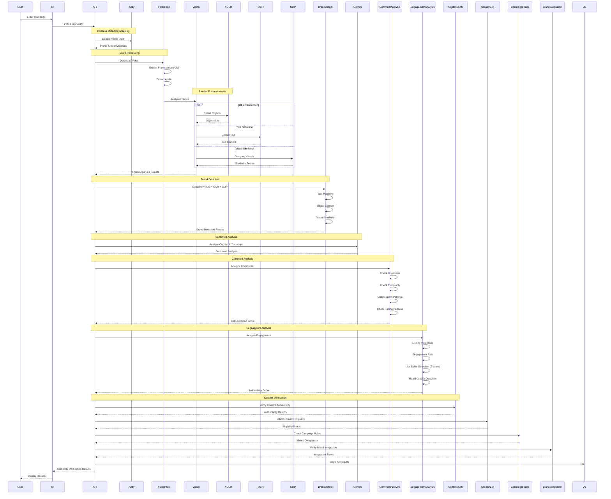
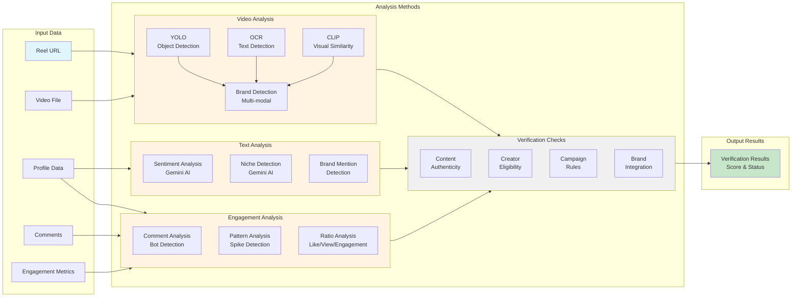

# System Architecture & Flow

## System Architecture Diagram

```mermaid
graph TB
    subgraph Frontend["Frontend Layer"]
        UI["Next.js Web UI<br/>page.tsx"]
    end
    
    subgraph API["API Layer"]
        APIVerify["/api/verify<br/>Full Verification"]
        APIProfile["/api/profile<br/>Profile Scraping"]
        APIAnalyze["/api/analyze<br/>Video Analysis"]
        APISentiment["/api/sentiment/gemini<br/>Sentiment Analysis"]
        APIEngagement["/api/verify/engagement<br/>Engagement Verification"]
        APINiche["/api/creators/niche-analysis<br/>Niche Detection"]
    end
    
    subgraph Services["Service Layer"]
        VideoProc["Video Processor<br/>Download & Extract"]
        VisionAnalyzer["Vision Analyzer<br/>Frame Analysis"]
        SentimentService["Sentiment Service<br/>Gemini AI"]
        EngagementService["Engagement Service<br/>Pattern Analysis"]
        NicheService["Niche Service<br/>Gemini AI"]
        CommentService["Comment Analysis<br/>Bot Detection"]
        BrandService["Brand Detection<br/>Multi-modal"]
        ContentAuth["Content Authenticity<br/>Verification"]
        CreatorElig["Creator Eligibility<br/>Check"]
        CampaignRules["Campaign Rules<br/>Checker"]
        BrandIntegration["Brand Integration<br/>Verification"]
    end
    
    subgraph External["External APIs"]
        Gemini["Google Gemini<br/>Sentiment & Niche"]
        Apify["Apify Scraper<br/>Instagram Data"]
        Shazam["Shazam API<br/>Audio Recognition"]
        OpenAI["OpenAI API<br/>Transcription"]
    end
    
    subgraph AI["AI Processing"]
        YOLO["YOLO v8<br/>Object Detection"]
        OCR["Tesseract OCR<br/>Text Detection"]
        CLIP["CLIP<br/>Visual Similarity"]
    end
    
    subgraph Storage["Storage"]
        DB[("PostgreSQL<br/>Database")]
        LocalStorage["Local Storage<br/>Videos & Frames"]
        Redis[("Redis<br/>Queue")]
    end
    
    UI -->|"Submit Reel URL"| APIVerify
    UI -->|"Scrape Profile"| APIProfile
    UI -->|"Analyze Video"| APIAnalyze
    UI -->|"Check Sentiment"| APISentiment
    UI -->|"Verify Engagement"| APIEngagement
    UI -->|"Detect Niche"| APINiche
    
    APIVerify --> VideoProc
    APIVerify --> VisionAnalyzer
    APIVerify --> SentimentService
    APIVerify --> EngagementService
    APIVerify --> CommentService
    APIVerify --> BrandService
    APIVerify --> ContentAuth
    APIVerify --> CreatorElig
    APIVerify --> CampaignRules
    APIVerify --> BrandIntegration
    
    APIProfile --> Apify
    APIAnalyze --> VideoProc
    APIAnalyze --> VisionAnalyzer
    APISentiment --> SentimentService
    APIEngagement --> EngagementService
    APIEngagement --> CommentService
    APINiche --> NicheService
    
    VideoProc -->|"Download Video"| LocalStorage
    VideoProc -->|"Extract Frames"| VisionAnalyzer
    VideoProc -->|"Extract Audio"| Shazam
    VideoProc -->|"Extract Audio"| OpenAI
    
    VisionAnalyzer -->|"Process Frames"| YOLO
    VisionAnalyzer -->|"Process Frames"| OCR
    VisionAnalyzer -->|"Process Frames"| CLIP
    VisionAnalyzer --> BrandService
    
    BrandService --> YOLO
    BrandService --> OCR
    BrandService --> CLIP
    
    SentimentService --> Gemini
    NicheService --> Gemini
    
    APIProfile -->|"Store Data"| DB
    EngagementService -->|"Store Results"| DB
    CommentService -->|"Store Results"| DB
    
    VideoProc -.->|"Queue Jobs"| Redis
    
    style UI fill:#e1f5ff
    style APIVerify fill:#fff4e1
    style APIProfile fill:#fff4e1
    style APIAnalyze fill:#fff4e1
    style APISentiment fill:#fff4e1
    style APIEngagement fill:#fff4e1
    style VideoProc fill:#f0f0f0
    style VisionAnalyzer fill:#f0f0f0
    style SentimentService fill:#f0f0f0
    style EngagementService fill:#f0f0f0
    style CommentService fill:#f0f0f0
    style BrandService fill:#f0f0f0
    style Gemini fill:#c8e6c9
    style Apify fill:#c8e6c9
    style DB fill:#ffccbc
    style LocalStorage fill:#ffccbc
```

## Complete Verification Flow Sequence Diagram

## Analysis Methods Flow Diagram

## Component Overview

### Frontend (Next.js)
- **page.tsx**: Main UI with tabs for scraping, analysis, and verification
- Handles user input and displays results

### API Routes
- **/api/verify**: Complete verification pipeline (all analyses)
- **/api/profile**: Scrape Instagram profile and reel data
- **/api/analyze**: Video frame analysis (YOLO, OCR, CLIP)
- **/api/sentiment/gemini**: Sentiment analysis using Gemini
- **/api/verify/engagement**: Engagement authenticity verification
- **/api/creators/niche-analysis**: Creator niche detection

### Analysis Services

#### Video & Vision Analysis
- **Video Processor**: Downloads videos, extracts frames and audio
- **Vision Analyzer**: Processes frames with YOLO, OCR, and CLIP
- **Brand Detection**: Multi-modal brand detection combining:
  - YOLO object detection (chocolate, bottle, etc.)
  - OCR text detection (brand names in frames)
  - CLIP visual similarity (product image matching)
  - Confidence scoring (0.0-0.95)

#### Text Analysis
- **Sentiment Service**: Uses Gemini AI to analyze:
  - Caption sentiment (positive/negative/neutral)
  - Transcript sentiment
  - Positive publicity assessment
  - Confidence scores and reasoning
- **Niche Service**: Determines creator niches using Gemini:
  - Analyzes bio and latest posts
  - Returns multiple niches with confidence scores
  - Available niches: Tech, Fashion, Food, Travel, Fitness, Beauty, Gaming, Education, Entertainment, Lifestyle, Kids, Other
- **Brand Mention Detection**: Detects brand mentions in text

#### Engagement Analysis
- **Comment Analysis**: Detects bot activity:
  - Duplicate comments detection
  - Emoji-only comments
  - Generic/spam patterns (18+ patterns)
  - Suspicious timing patterns (rapid commenting)
  - Bot likelihood score (0-1)
- **Engagement Service**: Pattern analysis:
  - Like-to-view ratio (expected: 0.1% to 20%)
  - Engagement rate (expected: 0.1% to 15%)
  - Comment-to-like ratio
  - Like spike detection (Z-score method, >2 std dev)
  - Rapid growth detection (>1000 likes/hour)
  - Authenticity score (0-1)

#### Verification Services
- **Content Authenticity**: Verifies content is authentic
- **Creator Eligibility**: Checks if creator meets requirements
- **Campaign Rules Checker**: Validates against campaign rules
- **Brand Integration**: Verifies brand integration quality

### External Integrations
- **Google Gemini**: Sentiment analysis and niche detection
- **Apify**: Instagram data scraping (profile, reel, comments)
- **Shazam**: Audio/music recognition
- **OpenAI**: Video transcription

### AI Models
- **YOLO v8**: Object detection in video frames
- **Tesseract OCR**: Text extraction from frames
- **CLIP**: Visual similarity matching for brand detection

### Storage
- **PostgreSQL**: Stores verification results, campaigns, creators, submissions
- **Local Storage**: Temporary video files and extracted frames
- **Redis**: Job queue for async processing (optional)

## Complete Verification Flow

1. **User submits reel URL** → Frontend sends request to `/api/verify`

2. **Profile Scraping** → Apify scrapes Instagram:
   - Profile data (followers, bio, verification status)
   - Reel metadata (likes, comments, views, caption)
   - Comments (text, authors, timestamps)
   - Latest posts (for historical comparison)

3. **Video Download** → Video processor downloads video from URL

4. **Frame Extraction** → Frames extracted every 2 seconds (configurable)

5. **Parallel Frame Analysis** → Each frame analyzed simultaneously:
   - **YOLO**: Detects objects (chocolate, bottle, person, etc.)
   - **OCR**: Extracts text from frames
   - **CLIP**: Compares visual similarity to reference images

6. **Brand Detection** → Multi-modal analysis:
   - Text matching (OCR results)
   - Object context (YOLO results)
   - Visual similarity (CLIP results)
   - Confidence scoring and validation

7. **Sentiment Analysis** → Gemini analyzes:
   - Caption sentiment separately
   - Transcript sentiment separately
   - Overall positive publicity assessment

8. **Niche Detection** → Gemini analyzes:
   - Creator bio
   - Latest 5 posts
   - Returns multiple niches with confidence

9. **Comment Analysis** → Bot detection:
   - Duplicate comments
   - Emoji-only comments
   - Generic/spam patterns
   - Suspicious timing patterns
   - Bot likelihood score

10. **Engagement Verification** → Pattern analysis:
    - Like-to-view ratio check
    - Engagement rate check
    - Like spike detection (Z-score > 2.0)
    - Rapid growth detection
    - Authenticity score calculation

11. **Content Verification** → Checks:
    - Content authenticity
    - Creator eligibility
    - Campaign rules compliance
    - Brand integration quality

12. **Results Storage** → All results saved to PostgreSQL

13. **Response** → Complete verification results returned to frontend

## Analysis Details

### Brand Detection Process
1. **Text Matching**: Searches OCR text for brand/product names
   - Flexible matching (handles OCR errors)
   - Case-insensitive
   - Partial matches for compound names

2. **Object Context**: Uses YOLO objects to boost confidence
   - Brand-related objects: bottle, cup, can, pack, box, bag, container, food, chocolate, candy, snack
   - If brand text found + related object = higher confidence

3. **Visual Similarity**: CLIP matches boost brand confidence
   - High similarity (≥0.50): Strong evidence
   - Medium similarity (0.40-0.50): Requires contextual evidence
   - Low similarity (<0.40): Rejected

4. **Confidence Calculation**:
   - Base confidence: 0.5
   - Multiple occurrences: +0.05 per occurrence (max +0.2)
   - Uppercase appearance: +0.2
   - Full brand match: +0.15
   - Related objects: +0.1
   - Visual similarity: Weighted combination
   - Maximum confidence: 0.95

### Engagement Spike Detection
- **Method**: Z-score statistical analysis
- **Process**:
  1. Collects like counts from historical posts (latest 10)
  2. Calculates average (μ) and standard deviation (σ)
  3. Computes Z-score: `Z = (current_likes - μ) / σ`
  4. Flags if Z-score > 2.0 (more than 2 standard deviations above average)
- **Works for static uploads**: Compares cross-post performance, not time-based

### Comment Bot Detection
- **Duplicate Comments**: 30% weight
- **Emoji-only Comments**: 20% weight
- **Generic Comments**: 20% weight
- **Spam Patterns**: 15% weight
- **Suspicious Timing**: 15% weight
- **Risk Levels**:
  - High risk: ≥0.7 (70%+ bot likelihood)
  - Moderate risk: 0.4-0.7 (40-70%)
  - Low risk: 0.2-0.4 (20-40%)
  - Very low risk: <0.2 (<20%)

## Key Features

- **Multi-modal Analysis**: Combines video, audio, text, and engagement data
- **Parallel Processing**: Frames analyzed in parallel for performance
- **AI-Powered**: Uses Gemini AI for sentiment and niche detection
- **Computer Vision**: YOLO, OCR, and CLIP for comprehensive video analysis
- **Statistical Analysis**: Z-score method for spike detection
- **Bot Detection**: Multi-factor comment analysis
- **Comprehensive Verification**: Multiple verification checks (content, creator, campaign, brand)
- **Scalable**: Supports async processing with Redis queue
