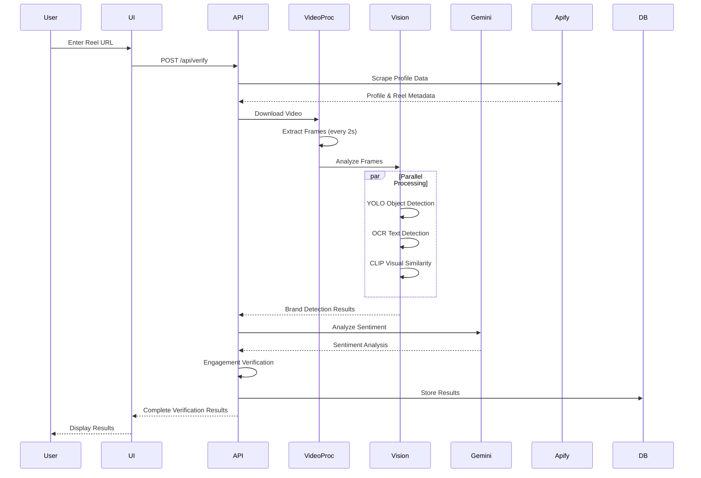

# System Architecture & Flow

## Data Flow Sequence Diagram

## Component Overview

### Frontend (Next.js)
- **page.tsx**: Main UI with tabs for scraping, analysis, and verification
- Handles user input and displays results

### API Routes
- **/api/verify**: Complete verification pipeline
- **/api/profile**: Scrape Instagram profile and reel data
- **/api/analyze**: Video frame analysis (YOLO, OCR, CLIP)
- **/api/sentiment/gemini**: Sentiment analysis using Gemini
- **/api/verify/engagement**: Engagement authenticity verification
- **/api/creators/niche-analysis**: Creator niche detection

### Services
- **Video Processor**: Downloads videos, extracts frames and audio
- **Vision Analyzer**: Processes frames with YOLO, OCR, and CLIP
- **Sentiment Service**: Uses Gemini AI for sentiment analysis
- **Engagement Service**: Detects fake engagement patterns
- **Niche Service**: Determines creator niches using Gemini

### External Integrations
- **Google Gemini**: Sentiment analysis and niche detection
- **Apify**: Instagram data scraping
- **Shazam**: Audio/music recognition
- **OpenAI**: Video transcription

### AI Models
- **YOLO v8**: Object detection in video frames
- **Tesseract OCR**: Text extraction from frames
- **CLIP**: Visual similarity matching for brand detection

### Storage
- **PostgreSQL**: Stores verification results, campaigns, creators
- **Local Storage**: Temporary video files and extracted frames
- **Redis**: Job queue for async processing (optional)

## Verification Flow

1. **User submits reel URL** → Frontend sends request to `/api/verify`
2. **Profile Scraping** → Apify scrapes Instagram profile and reel metadata
3. **Video Download** → Video processor downloads video from URL
4. **Frame Extraction** → Frames extracted every 2 seconds
5. **Parallel Analysis** → Each frame analyzed with:
   - YOLO for object detection
   - OCR for text extraction
   - CLIP for visual similarity
6. **Brand Detection** → Results combined to detect brand presence
7. **Sentiment Analysis** → Gemini analyzes caption and transcript
8. **Engagement Verification** → Pattern analysis detects fake engagement
9. **Results Storage** → Results saved to PostgreSQL
10. **Response** → Complete verification results returned to frontend

## Key Features

- **Multi-modal Analysis**: Combines video, audio, text, and engagement data
- **Parallel Processing**: Frames analyzed in parallel for performance
- **AI-Powered**: Uses Gemini AI for sentiment and niche detection
- **Computer Vision**: YOLO, OCR, and CLIP for comprehensive video analysis
- **Engagement Verification**: Statistical analysis to detect fake engagement
- **Scalable**: Supports async processing with Redis queue
